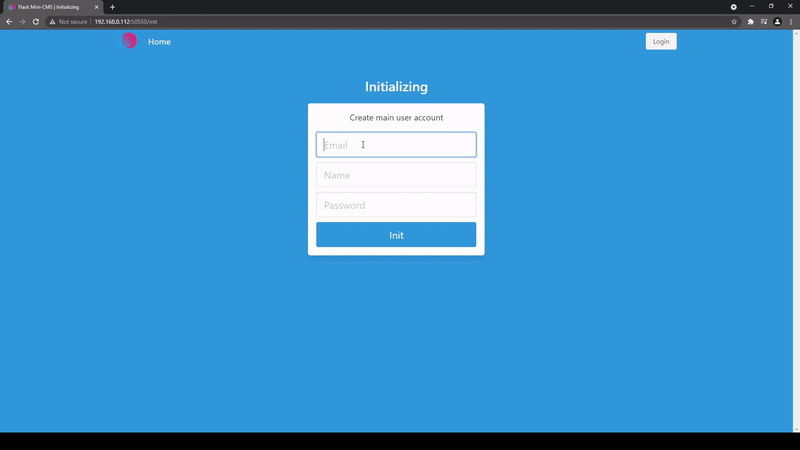

# Flask Mini CMS
## Description
This is a mini cms developed on Python with Flask framework for one of my project which needed very simple content management for blog. Project implements the work with posts(articles), images, users and also includes dashboard with very basic stats. It's multi page app with server rendering and jinja templating. Docker ready.

## Preview

  

## How to run
1. Open your terminal in `server` folder.  
2. Install virtual environment.  
`python3 -m venv env` 
3. Activate virtual environment. 
`source env/bin/activate` 
4. Set environment variables. 
`set -a; source .env.dev; set +a` 
5. Install requirement packages. 
`pip install -r requirements.txt` 
6. Run application. 
`flask run` 
7. Create core user. 
Go to `http://localhost:5000/init` and create your core user to work with system (change `localhost` and `5000` depending on your settings).

## Notes and features
* **Flask**. [Flask](https://flask.palletsprojects.com/en/2.0.x/) is a lightweight, simple framework suitable for projects like this. Not a best solution for high load, difficult services, but it's ok in case with my app.
* **Database**. As data storage was chosen SQLite.
* **WSGI**. To forward requests from web server to app I preferred [Gunicorn](https://gunicorn.org/) since project not require more powerfull and async server.
* **Bulma**. As css framework in this project I used [Bulma](https://bulma.io/). It's lightweight, modern, mobile friendly and easy to use.
* **Summernote**. To create and edit posts (articles) with HTML-markup I chosed [Summernote](https://summernote.org/) js library.
* **Auth**. To implement authorization on the site, I used the [Flask-Login](https://flask-login.readthedocs.io/en/latest/) library.
* **API**. Project contains simple public REST Api to add possibility to getting content for third party apps.
* **Requests Limiter**. To avoid overloading the server, I use the [Flask-Limiter](https://flask-limiter.readthedocs.io/en/stable/) library to limit the number of requests.
* **Bleach**. Another useful library that I use is [Bleach](https://bleach.readthedocs.io/en/latest/), with it I check html markup security (malware scripts for example).
* **Webp**. All images uploaded to the server are converted to webp format. This is necessary because most of the images will only be used on web.
* **Docker**. I am using [Docker](https://www.docker.com/) to deploy this application, so the project contains a Dockerfile and a docker-compose file.

## Deploy 
* **Docker** 
`cd ~/path/to/flask-mini-cms/server` 
`docker build -t flask-mini-cms .` 
`docker run -d -p 50550:5000 --volume ~/path/to/flask-mini-cms/server/project:/code/server/project flask-mini-cms` 
* **Docker compose** 
`cd ~/path/to/flask-mini-cms` 
`docker-compose up -d` 

## Todos
In the future, this application can be expanded in a very large number of directions, which are inherent in cms. Also I have already used it several times as a template for other small solutions. Anyway, there are a few things I would add or improve:
* **Auth login logic.** When I was developing this solution, it seemed like a good idea to redirect users to the profile page after a successful login. But now, I would like to redirect users where they were going, before the login page, this is the more correct way.
* **Multi language system.** Since the application is mainly designed for working with a text blog, it would be nice to be able to work with several languages at once.
* **Mobile menu.** Mobile menu is awful, definitely worth a makeover.
* **Architecture.** When I started developing this application, it seemed to be slightly smaller than it turned out in the end, especially considering the possibility of further expansion, the application needs some revision of architectural decisions.
